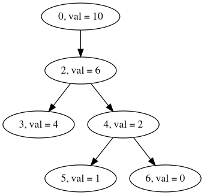

# MergeTrees

This is a framework for computing various comparison measures between merge trees such as the bottleneck distance, the tree edit distance, total persistences and so on.  

## Requirements
System requirements are Java8 (JDK version >=15.x), a C++ compiler and Python (version >=3).  
You will also need to install the `pybind11` python module.  
Click [Here](https://pybind11.readthedocs.io/en/stable/installing.html) for details on how to do it.  
Once `pybind11` is installed, to build the code, run the following command in the home directory for Linux systems for the gcc compilers.  
`g++ -O2 -shared -std=c++11 -fPIC $(python3 -m pybind11 --includes) *.cpp -o MergeTreeLibrary$(python3-config --extension-suffix)`  

This will create a python library in the project folder that can be imported and used as part of other Python scripts as well.  

## Usage


To run an experiment, create an input file in the format as shown below (say `ExampleMakeFile`) and run `python3 Driver.py ExampleMakeFile`.  

## File Formats

### Meta Input File
The first line contains the name of the experiment.  
The second line contains the experiment mode. Currently, three modes are supported, `Pairwise`, `Sequential`, `OnevRest`. (Case sensitive)  
The next line is the path to the folder where the input tree files are stored.  
The next few lines give the number and the names of the tree files depending on the mode.  
After that is the output folder path (this will be created if it doesn't already exist).  
The next line `m` is the number of computations that require 2 inputs, such as the distance measures.  
The next `m` lines contain the names of the distances to be computed along with optional flags.  
The distances currently supported are  
    `bottleneck`, `CW-MTED` and `CO-MTED` (the Tree Edit distances with the CW and CO cost models)  
    The flag `plots` plots the persistence diagram in case of the bottleneck distance and generates the graphviz file for the lowest cost mapping for the CW and CO Tree Edit Distances.  
    The flag `in_normal` normalises the trees such that the root is fixed at 0 and the modulus of the range of the function is 1.  
    The flag `out_normal` divides the resulting distance by an appropriate normalizing number. For the CW and CO Tree Edit distances, this is the sum of the distances of the two trees to the empty tree.  
    The distance name and the optional flags are separated by a semicolon (;)
The next line `l` is the number of computations that are essentially 1 input only.  
The next `l` lines contain the names of these measures along with their optional flags.  
The measures currently supported are
    `Lp` - the p-th total persistence of the tree. The first flag is the parameter `p`. Use -1 for the range of the function. The flag `normal` normalises by the range of the function.  
    `depth` of the tree  
    `feat` - The number of features in the merge tree.  
    `pers_dist` - Returns the distributions of the persistences. The flags `plots` and `normal` work as before.  

### Tree Input File

The framework supports two different Tree Input File formats. Note however that the `.jt` file extension is currently not built inside the library and the code for it exists only in the `Driver.py` file that runs the Experiment.

#### TreeSkeleton File
The first line contains an integer `n` which is the number of nodes in the tree.  
The next n lines contain space-separated numbers about each node as follows.  
`nodeID parentID number_of_children childrenIDs functionValue`  
The `childrenIDs` are a space separated list of each node's children's `nodeID`.  
We require the `parentID` of the root node to necessarily be -1.  
For example, for the tree shown in the figure, the TreeSkeleton File will read



```
6
0 -1 1 2 10
2 0 2 3 4 6
3 2 0 4
4 2 2 5 6 2
5 4 0 1
6 4 0 0
```

#### MergeTree.jt File
This file must end with the `.jt` extension.  
The first line contains an integer `n` which is the number of nodes in the tree.  
The next n lines contain space-separated numbers about each node as follows.  
`nodeID parentID pers_pair_ID max_ID functionValue number_of_children childrenIDs `  
The `childrenIDs` are a space separated list of each node's children's `nodeID`.  
We require the `parentID` of the root node to necessarily be -1.  

### Output
The outputs are stored in two `csv` files in the Output Directory.  
The tree maps are stored in folders generated in the Output Directory.  

The framework assigns a `CompID` to each pairwise or single computation. For pairwise computations between two trees (specified by files `Tree1` and `Tree2`), the `CompID` is just the sum `Tree1Tree2`, whereas for single computations (such as depth, feat) it is the file name itself.
All the computations made in a specific run are stored in the row specified by the `CompID`.  

The mapping files and the graphviz files generated for the MTED are stored in folders named `CompID` inside the Output Directory. The maps for the input normalised trees are in a folder called `normalisation` inside the `CompID` subfolder.  


## Interactively
After building the Python library above, you can import it using `import MergeTreeLibrary` in a python REPL or a script.
Trees are stored as `TreeSkeleton` objects.  

Example  

```python
> import MergeTreeLibrary
> T1 = MergeTreeLibrary.generateTree("./Examples/Inputs/TreeA")
> bottleneck = MergeTreeLibrary.bottleneck("./Examples/Inputs/TreeA", "./Examples/Inputs/TreeB")
> MergeTreeLibrary.CWMTED("./Examples/Inputs/TreeA", "./Examples/Inputs/TreeB", "./")
```

and so on.

## Functions
The class `TreeSkeleton` contains all the functions which are measures of a single merge tree.
The class `TreePair` (work in progress) contains the functions to compute the pairwise distances.  
NOTE: While the class `TreePair` is being constructed, the distance computations are put directly into the namespace `mergeTrees`

## How to add other measures
Step 1  
If you are creating `.jar` files, add them in the home repository, make a system call to the file, output the result to console and store it using the `pipeline` function defined in the namespace `mergeTrees`  
If there are auxiliary files being generated such as tree maps, store them in the appropriate `CompID` folders inside the Output Directory.

Step 2  
Python bindings are defined in the `MergeTreeLibrary.cpp` file as shown in the documentation for `pybind11`  

Step 3  
For pairwise measures such as distances, add the computation in `Utilities.py` inside the function `pairwiseCompare` using string matching.
Any optional flags and the computations to be performed are to be added there as well.  
Similarly for solo measures as well.

Step 4  
Compile the files as before and run as before.

### Example

Let's say the jar file is `Example.jar` being called with TreeSkeleton Files `str1` and `str2`.
The function in `TreePair.cpp` will look like

```C++
double example (std :: string str1, std :: string str2) {
    /*
    Any other computation such as generating the trees and so on that may be required before the jar file call
    */
    std :: string command = "java -jar CW-MTED.jar " + str1 + " " + str2;
    char *cmnd = &command[0];
    std :: string output = pipeline(cmnd);
    return stod(output);
}
```
Its python binding written in `MergeTreeLibrary.cpp` will look like

```python
m.def("Example", & mergeTrees :: example)
```
appropriately modified if you are using it in a different namespace or within a class.  

Then modify the function `pair_compute` in `Utilities.py` by adding

```python
elif MeasureName == "Example":
    rval = MergeTreeLibrary.Example(str1, str2)
```

## In Progress
Wasserstein Distance  
Implementation of `TreePair` which should reduce file input output time and hence speed up computation.  

**Warnings and Remarks** - In general, after every tree manipulation such as insertion or deletion, the persistence pairings will have to be manually reset and regenerated or it might lead to the program crashing or giving undefined behaviour.  
The IDs all have to be integers for now.  
The `.jt` files generated during the Tree Edit Distance computations explicitly have the extension `.jt`.  
